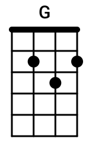

# Chord Renderer

Render chords by `json` files to `png` images.

# Example

`g-chord.json` file:
```
{
  "Name": "G",
  "FretCount": 5,
  "StringCount": 4,
  "FrettedNotes": [
    {
      "FretNumber": 2,
      "StringNumber": 3
    },
    {
      "FretNumber": 3,
      "StringNumber": 2
    },
    {
      "FretNumber": 2,
      "StringNumber": 1
    }
  ]
}
```

Result `png` file:




# Usage

## CLI

```
chord-renderer <chord-file.json> <image-width> <image-height> <result.png>
```

## Docker

```
docker run \
    -v $(pwd)/chordinfo_test/testdata:/input \
    -v $(pwd):/output \
    chord-renderer /input/g-chord.json 150 250 /output/g-chord.png
```


# Build

Building executable and docker image:
```
task build
```

